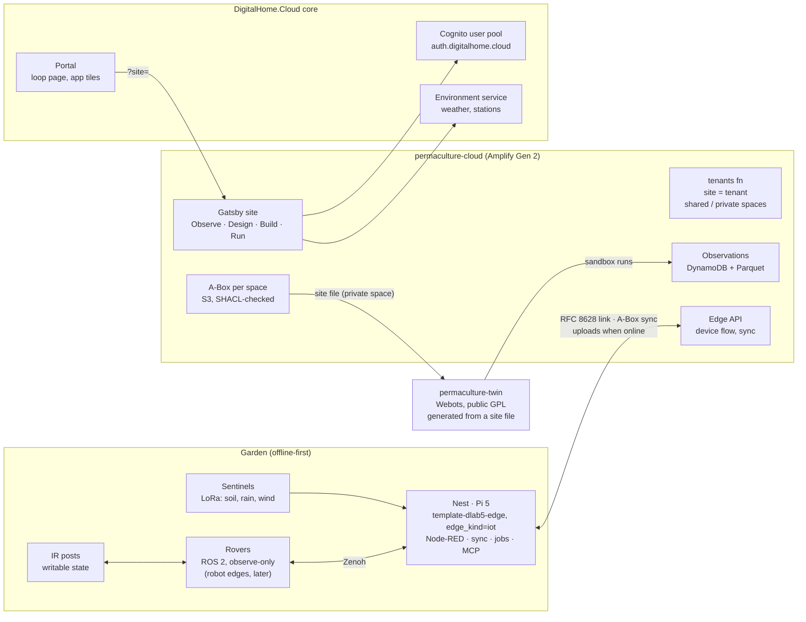

# Architecture

Four parts, one rule: robots and posts talk only to the nest, and the cloud
never steers the garden. DigitalHome.Cloud provides login, the Portal and the
weather; everything else is the permaculture product's own.

## One site model, three outputs

Publishing a site version in the Design stage writes the A-Box of the shared
and private spaces. From it:

1. the cloud renders the app (map, zones, plants, register);
2. the nest pulls its copy with `edge/sync.py` and validates it with the same shapes;
3. the twin generator builds a Webots world from the site file (today a JSON
   site file, later the A-Box export).

## Where things live

| Thing | Where | Public? |
|---|---|---|
| Build plan, ADRs, workflow, ontology | this repository (PermTek-5) | yes; no site specifics |
| Twin code + demo site | `twin/` → `permaculture-twin` | yes, GPL-3.0-or-later |
| Real site file, plan, calendars, original twin, site notes | private site pack, outside this repository | never |
| Cloud | `repos/permaculture-cloud` (to generate) | GPL template; site data in S3 only |
| Nest edge | `repos/permaculture-nest-edge` (to generate) | GPL template; privacy contract applies |
| Users, weather, Portal | DHC core / Portal | shared platform |
