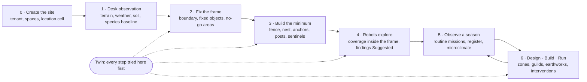

# Workflow: from a new site to a running garden

The story the product follows, for any site. The first real site is private;
PermaDemo is the invented one everyone can run. Stages use the Portal's loop
(`docs/design-identity.md`): **Observe · Design · Build · Run**.

Three rules shape the order:

1. **People draw the boundaries, robots explore inside them.** The boundary is
   the robots' safety envelope; it is never discovered by a robot.
2. **Observe before designing, desk before field, twin before garden.** Every
   physical step is tried in the twin first.
3. **Machines suggest, people confirm.** Nothing a robot or model finds enters
   the site model or the register until a person accepts it.

## 0 · Start from the home

*Portal · a minute · the home's owner*

- Sign in with the DigitalHome.Cloud account (one user pool).
- In the Portal, open the home and choose **Permaculture**. PermTek-5 opens
  with `?home=…`; an owner of the home starts its habitat (ADR 0015). This
  creates a tenant with a `shared` space; the owners are its admins, with
  two-step sign-in. Sites without a home (PermaDemo, study sites) are still
  created by an operator (ADR 0009).
- The location is the home's, in DHC core: its area (country and postal code)
  gives the weather. Nothing about the place is copied into PermTek-5; finer
  coordinates, when needed, stay in the private space.

**Output**: a habitat with the area's climate on its page.

## 1 · Desk observation (Observe)

*Cloud · hours · no hardware*

- Terrain from IGN RGE ALTI 1 m: slope, aspect, contours, sun hours.
- Weather history and normals from the DHC environment service.
- Soil and geology maps (on the first site: a heavy clay).
- Baseline species: GBIF and INPN records for the commune (TAXREF cached).

**Output**: a first picture of the site before anyone digs. The baseline
species are *expected*, not *observed*.

## 2 · Fix the frame (Design)

*Cloud and twin · a day · the owner*

The owner draws what robots may never decide for themselves:

| Element | Source |
|---|---|
| Boundary (geofence) | cadastral parcel, georeferenced owner's plan, or the fence line walked with a phone |
| Fixed objects | house, existing trees, pond, tank, paths |
| No-go areas | pond edge, steep banks, bat roosts and nests, the neighbour's side |
| First zones | rough zones 1–5 (they change later; the boundary does not) |

All of it goes into the **private** space as the site file. The **twin**
builds a world from it at once and answers the first questions:

- Can a rover handle this slope, and where must it go along contours?
- Where should the nest, the UWB anchors and the first IR posts go?
- Is every part of the area reachable from the nest without leaving the frame?

**Output**: a published site frame (version 1) and a twin world of it.

## 3 · Build the minimum (Build)

*Garden · weeks · owner and helpers*

- Fence, and power and connectivity for the nest.
- The **nest** (Raspberry Pi 5, nest edge): installed, then paired with the
  cloud by the device flow. The owner approves the code on `/link`.
- UWB anchors surveyed with RTK; the first IR posts and soil sentinels.
- **As-built** positions go back into the site model (version 2), and the
  twin is regenerated. The twin now matches what stands in the garden.

**Output**: a nest that runs without internet and uploads when it can.

## 4 · Robots explore inside the frame (Observe)

*Twin first, then garden · days to weeks · rovers*

A rover's first job is to map what the plan does not show, not to visit
posts.

- **Exploration is coverage**: the frame is split into cells; a rover leaves a
  decaying "visited" trace in each cell it covers and heads for the cells
  whose traces are oldest. Two rovers share the work by stigmergy, as with
  posts: claims and traces, no messages.
- Routes stay inside the geofence and outside no-go areas, follow contours,
  and climb only along the fall line at passages.
- Findings are **Suggested**: an obstacle, a tree, a path, a wet spot, a
  species (camera, microphone).
- The owner reviews them in a 10-minute session: "yes, an oak", "no, a
  shadow". Confirmed findings enter the site model; the twin is regenerated.
- Exploration ends when coverage is complete and the suggestions dry up. Then
  posts are placed where observation matters and the **post routine** starts.

**Output**: a confirmed map, posts in the right places, the routine running.

## 5 · Observe a season (Observe · Run)

*Months, ideally a full year · weekly 10-minute reviews*

- Routine missions: post visits, soil moisture, phenology, IR traces.
- Species register: detections, evidence, confirmation.
- Microclimate per zone; alerts against thresholds.
- Interventions are suggested (water here, inspect that anchor) and accepted
  or rejected by a person.

The classic permaculture advice, to observe a full year before major design,
is built into the order rather than left to discipline.

## 6 · Design, build, run: the loop (Design · Build · Run)

- **Design**: zones, guilds and plants in the Modeler, based on what was
  observed; what-if runs in the twin (a fascine, a path, a third rover).
- **Build**: earthworks and planting; as-built back into the model.
- **Run**: interventions accepted and done, missions adapted to the new site.
- Each published site version updates the cloud, the nest and the twin together.

Then back to Observe.

## What each stage needs from the system

| Stage | Cloud | Nest | Twin |
|---|---|---|---|
| 0 Create | site = tenant, spaces, location cell | — | — |
| 1 Desk | terrain import, environment service, GBIF/INPN baseline | — | — |
| 2 Frame | boundary and no-go editor, site file in the private space | — | world from the site file; geofence; reachability check |
| 3 Build | as-built edits, edge pairing | link, sync, sentinels | regenerate from as-built |
| 4 Explore | review of Suggested findings | coverage traces, store | **explore mission**, geofence-aware contour planner |
| 5 Observe | register, microclimate, interventions | post routine, detection jobs | replay of real data |
| 6 Loop | Modeler, publish | sync new versions | what-if runs |

## Where a real site stands

Kept with the site, in its private pack: which stages are done and what is next.
PermaDemo, the invented site in `twin/sites/permademo/`, runs through stages 2 and 4 in the twin.
